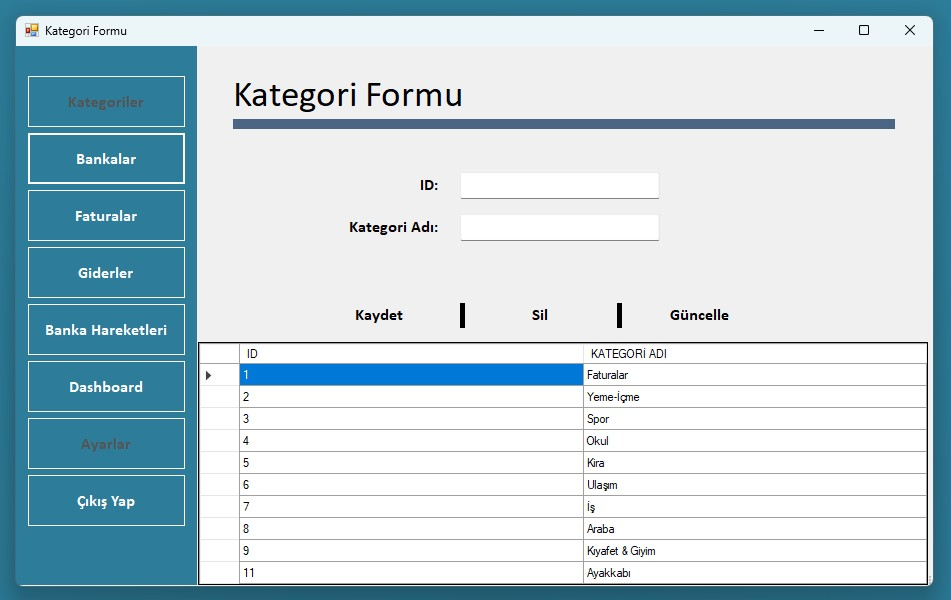
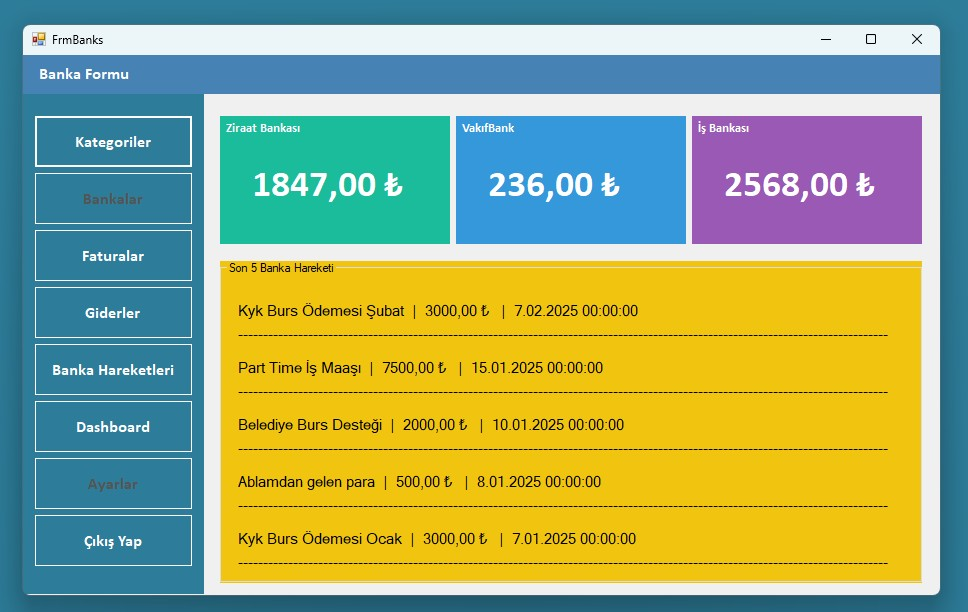
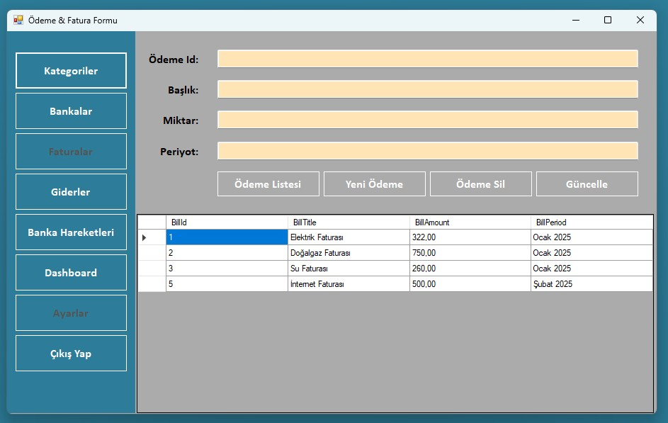
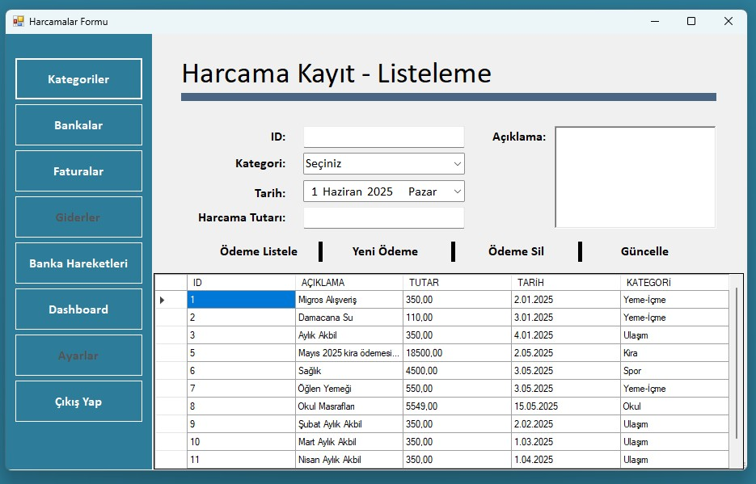
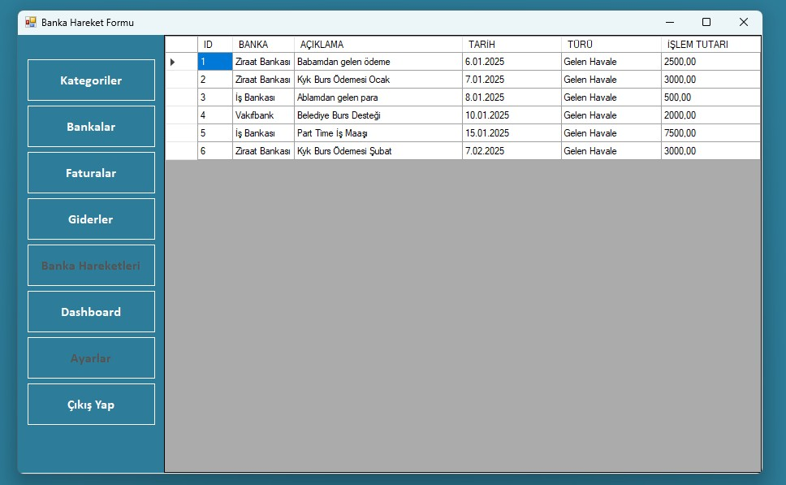
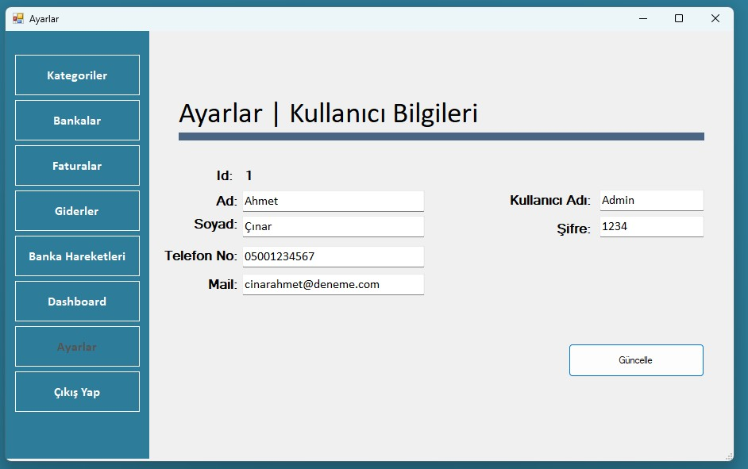
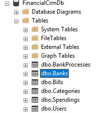
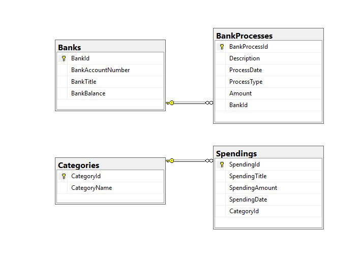
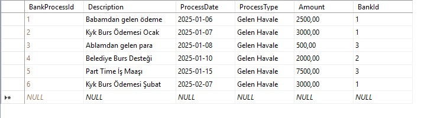

TR - Türkçe |

# 💼 Finansal Takip Uygulaması (C# | WinForms | EF | SQL Server)

Bu masaüstü uygulaması, kullanıcıların **fatura**, **harcama** ve **banka işlemlerini** manuel olarak kaydedebileceği, geçmişe yönelik mali verilerine kolaylıkla ulaşabileceği bir finansal takip sistemidir. Uygulama içerisinde yer alan **grafik destekli dashboard** ekranı ile kullanıcılar mali durumlarını anlık olarak analiz edebilir.

---

## 🎯 Proje Amacı

- Günlük, haftalık veya aylık **finansal hareketlerin manuel olarak kayıt altına alınması**  
- Gelir ve giderlerin **düzenli ve kategorize edilmiş şekilde saklanması**  
- Kaydedilen verilere hızlı erişim ve **grafiksel analiz** imkânı sunulması  
- **Kullanıcı bazlı filtreleme** ile kişisel verilerin güvenli tutulması  

---

## 🔧 Kullanıcı Ayarları Özelliği

Her kullanıcı sisteme kendi kullanıcı adı ve şifresi ile giriş yaptıktan sonra:

- **Kullanıcı Adı**
- **Şifre**
- **Telefon Numarası**
- **E-posta Adresi**

gibi bilgilerini **Ayarlar** ekranı üzerinden güncelleyebilir. Bu ekran sade ve kullanıcı dostu olacak şekilde tasarlanmıştır. Bu sayede kullanıcılar kendi iletişim ve hesap bilgilerini diledikleri zaman güncelleyerek sistemle etkileşimde kalabilirler.

---

## 📊 Uygulama Özellikleri

- Harcama, fatura, banka işlemleri gibi **finansal kayıtlar**
- Her kullanıcı için **kişisel veri erişimi**
- **Dashboard** formu ile grafik tabanlı veri analizi
- Günlük ve aylık finansal durum takibi
- Kullanıcı bilgilerini düzenleme (Ayarlar Formu)
- Temiz, anlaşılır ve pratik kullanıcı arayüzü

---

## 🛠️ Kullanılan Teknolojiler

- **C#** & **WinForms**  
- **Entity Framework (EF)** — *Database First* yaklaşımıyla yapılandırılmıştır  
- **LINQ** ile veri çekme ve analiz  
- **SQL Server** veritabanı  

---

## 👨‍💻 Hedef Kitle

- Yazılım geliştirmeye yeni başlayan **öğrenciler** (özellikle EF ve LINQ öğrenenler)
- Kişisel finansını takip etmek isteyen **bireysel kullanıcılar**
- Küçük işletmeler için **basit muhasebe yönetim aracı** arayanlar

---

## 📎 Notlar

Bu proje geliştirilmeye açıktır. Görüş, öneri veya katkılarınız için iletişime geçebilirsiniz. 😊

EN - English |

# 💼 Financial Tracking Application (C# | WinForms | EF | SQL Server)

This desktop application allows users to manually record their **invoices**, **expenses**, and **bank transactions**, providing easy access to past financial data. With the **dashboard form powered by graphs**, users can analyze their financial status in real time.

---

## 🎯 Project Purpose

- Record daily, weekly, or monthly **financial activities** manually  
- Store income and expenses in a **categorized and organized** manner  
- Provide fast access and **graphical analysis** of recorded data  
- Ensure **data security** through user-based filtering and access  

---

## 🔧 User Settings Feature

After logging into the system with their username and password, each user can update the following information through the **Settings** form:

- **Username**
- **Password**
- **Phone number**
- **Email address**

The settings form is designed to be simple and user-friendly. This allows users to keep their personal contact and account information up to date, increasing long-term usability and system security.

---

## 📊 Application Features

- Financial records for invoices, expenses, and bank transactions  
- **User-specific data access** and filtering  
- Dashboard screen with **graph-based data analysis**  
- Daily and monthly financial tracking  
- Personal information management (via Settings Form)  
- Clean and practical user interface  

---

## 🛠️ Technologies Used

- **C#** & **WinForms**  
- **Entity Framework (EF)** — structured using the *Database First* approach  
- **LINQ** for querying, filtering, and data analysis  
- **SQL Server** as the database solution  

---

## 👨‍💻 Target Audience

- **Students** learning software development and wanting hands-on practice with EF & LINQ  
- **Individuals** looking to manage their personal finances  
- **Small businesses** in need of a simple internal accounting tool  

---

## 📎 Notes

This project is open to contributions and improvements. Get in touch with suggestions. 😊

## Ekran Görüntüleri & Screenshots

### 🖼 Login View

  

### 🖼 Dashboard View

  

### 🖼 Category View

  

### 🖼 Banks View

  

### 🖼 Billing View

  

### 🖼 Spendings View

  

### 🖼 BankProcess View

  

### 🖼 Settings View

  

### 🖼 SQL_Tables View

  

### 🖼 SQL_Diagrams View

  

### 🖼 SQL_BankProcess View

  

