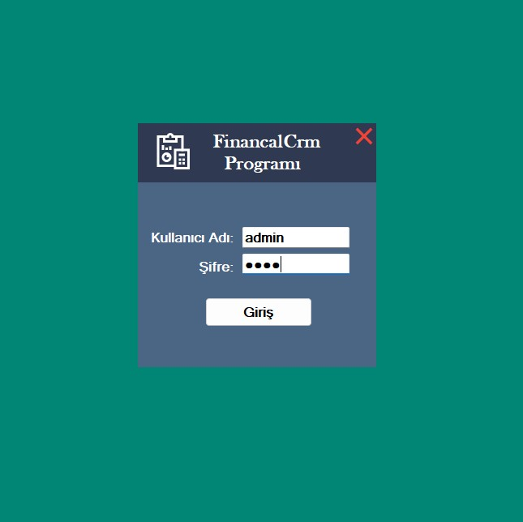
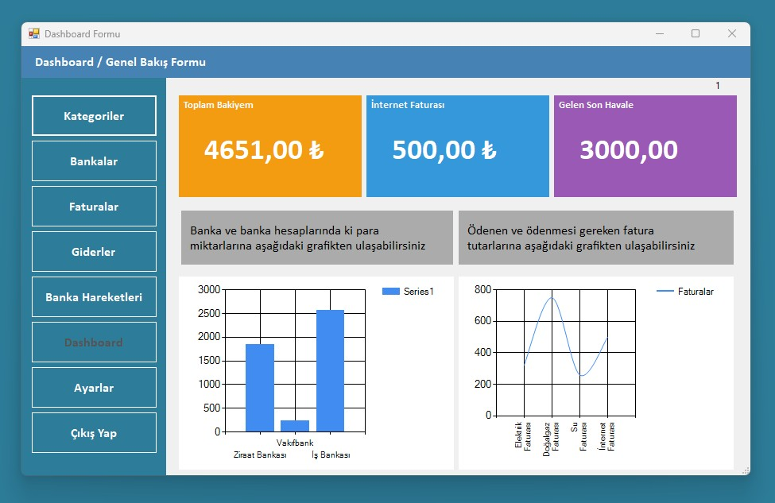

TR - Türkçe |

# 💼 Finansal Takip Uygulaması (C# | WinForms | EF | SQL Server)

Bu masaüstü uygulaması, kullanıcıların **fatura**, **harcama** ve **banka işlemlerini** manuel olarak kaydedebileceği, geçmişe yönelik mali verilerine kolaylıkla ulaşabileceği bir finansal takip sistemidir. Uygulama içerisinde yer alan **grafik destekli dashboard** ekranı ile kullanıcılar mali durumlarını anlık olarak analiz edebilir.

---

## 🎯 Proje Amacı

- Günlük, haftalık veya aylık **finansal hareketlerin manuel olarak kayıt altına alınması**  
- Gelir ve giderlerin **düzenli ve kategorize edilmiş şekilde saklanması**  
- Kaydedilen verilere hızlı erişim ve **grafiksel analiz** imkânı sunulması  
- **Kullanıcı bazlı filtreleme** ile kişisel verilerin güvenli tutulması  

---

## 🔧 Kullanıcı Ayarları Özelliği

Her kullanıcı sisteme kendi kullanıcı adı ve şifresi ile giriş yaptıktan sonra:

- **Kullanıcı Adı**
- **Şifre**
- **Telefon Numarası**
- **E-posta Adresi**

gibi bilgilerini **Ayarlar** ekranı üzerinden güncelleyebilir. Bu ekran sade ve kullanıcı dostu olacak şekilde tasarlanmıştır. Bu sayede kullanıcılar kendi iletişim ve hesap bilgilerini diledikleri zaman güncelleyerek sistemle etkileşimde kalabilirler.

---

## 📊 Uygulama Özellikleri

- Harcama, fatura, banka işlemleri gibi **finansal kayıtlar**
- Her kullanıcı için **kişisel veri erişimi**
- **Dashboard** formu ile grafik tabanlı veri analizi
- Günlük ve aylık finansal durum takibi
- Kullanıcı bilgilerini düzenleme (Ayarlar Formu)
- Temiz, anlaşılır ve pratik kullanıcı arayüzü

---

## 🛠️ Kullanılan Teknolojiler

- **C#** & **WinForms**  
- **Entity Framework (EF)** (ORM)  
- **LINQ** ile veri çekme ve analiz  
- **Model yapısı** ile güçlü nesne yönelimi  
- **SQL Server** veritabanı  

---

## 👨‍💻 Hedef Kitle

- Yazılım geliştirmeye yeni başlayan **öğrenciler** (özellikle EF ve LINQ öğrenenler)
- Kişisel finansını takip etmek isteyen **bireysel kullanıcılar**
- Küçük işletmeler için **basit muhasebe yönetim aracı** arayanlar

---

## 📎 Notlar

Bu proje geliştirilmeye açıktır. Katkıda bulunmak isteyenler için pull request'ler memnuniyetle karşılanır. Görüş, öneri veya katkılarınız için iletişime geçebilirsiniz. 😊

---

EN - English |

# 💼 Financial Tracking Application (C# | WinForms | EF | SQL Server)

This desktop application allows users to manually record their **invoices**, **expenses**, and **bank transactions** in a structured and categorized way. With the **graph-based dashboard form**, users can analyze their financial data visually and track their income and expenses easily over time.

---

## 🎯 Project Purpose

- To manually register daily, weekly, or monthly **financial activities**
- To categorize and store expenses and income in a regular, reliable format
- To provide **quick access and visual analytics** of the saved data
- To ensure **data privacy** with user-specific filtering (each user can only see their own data)

---

## 🔧 User Settings Feature

After logging into the system with their own credentials, users can update their personal information such as:

- **Username**
- **Password**
- **Phone Number**
- **Email Address**

These updates are done through a user-friendly **Settings Form**, designed with clarity and accessibility in mind. This feature enhances the long-term usability and security of the system.

---

## 📊 Application Features

- Manual record-keeping for expenses, invoices, and bank transactions
- Data filtering and display **specific to the logged-in user**
- **Dashboard Form** for visual analysis of financial data
- Daily and monthly financial status tracking
- Settings Form to **update personal information**
- Clean and practical user interface

---

## 🛠️ Technologies Used

- **C#** & **WinForms** for UI development  
- **Entity Framework (EF)** as the ORM  
- **LINQ** for data querying and filtering  
- **Model-based architecture** for code clarity  
- **SQL Server** for robust database management  

---

## 👨‍💻 Target Audience

- **Students and beginners** learning C#, EF, and LINQ  
- **Individual users** wanting to track their personal finances  
- **Small businesses** needing a basic accounting tool  

---

## 📎 Notes

This project is open to contributions and improvements. Feel free to fork the repository, submit pull requests, or get in touch with suggestions. 😊

## Ekran Görüntüleri & Screenshots

### 🖼 Login View

  

### 🖼 Dashboard View

  

### 🖼 Category View

  

### 🖼 Banks View

  

### 🖼 Billing View

  

### 🖼 Spendings View

  

### 🖼 BankProcess View

  

### 🖼 Settings View

  

### 🖼 SQL_Tables View

  

### 🖼 SQL_Diagrams View

  

### 🖼 SQL_BankProcess View

  

